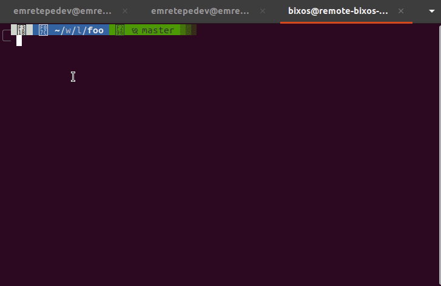

# Git Activity Mirror

A set of simple Bash scripts to automatically mirror commits and pushes from a primary repository (e.g., GitLab, Bitbucket) to a secondary repository (e.g., GitHub).

## About The Project

These scripts are for developers who work with multiple Git hosting services but want to maintain a public mirror of their work. This is a common scenario when your primary work is on a private or company-hosted GitLab/Bitbucket instance, but you still want to showcase your activity on your public profile.

The scripts work by creating an empty commit and pushing it to the target repository, effectively mirroring your activity.

---

## Getting Started

Follow these steps to set up and use the scripts.

### Prerequisites

- **Git** must be installed on your system.
- **A Bash-compatible shell** (like Bash or Zsh).

### Installation

1.  **Fork & Clone**

    First, fork this repository, then clone your forked repository to your local machine. It's convenient to clone it into your home directory.

2.  **Set the Environment Variable**

To allow the scripts and especially **global Git hooks** to locate this repository, you must set an environment variable.

Add the following line to your shell's configuration file (e.g., `~/.bashrc`, `~/.zshrc`) and reload your shell's configuration for the changes to take effect. **Remember to replace the path** with the actual location where you cloned the repository.

```bash
# Sets the location for the Git Activity Mirror scripts
export ACTIVITY_REPO_DIR="$HOME/git-activity-mirror"
```

3.  **Configuration**

You can configure the scripts by editing the `config.sh` file.

```bash
# show info messages (default is false)
SHOW_INFO_MESSAGES=false
```

4.  **Make Scripts Executable**

    Grant execution permissions to the scripts so they can be run from the command line.

    ```bash
    chmod +x /path/to/record-activity.sh
    chmod +x /path/to/publish-activity.sh
    ```

---

## Usage

You can use the scripts manually, but for the best experience, we recommend setting up aliases or Git hooks.

### Option 1: Using Git Hooks (Recommended)

For complete automation, you can configure the scripts to run as a `post-commit` or `pre-push` Git hook. This will trigger the mirror action automatically after every commit or before every push. You can find ready-to-use examples in the `git-hooks-examples` folder to get started.

To learn more, check out the [official Git Hooks documentation](https://git-scm.com/book/en/v2/Customizing-Git-Git-Hooks).

**Note:** Before using the hook scripts from the `git-hooks-examples` directory, you **must** set the `ACTIVITY_REPO_DIR` environment variable as described in the [Installation](#installation) section.

#### Husky Compatibility

For projects using [Husky](https://typicode.github.io/husky/) for Git hooks management, an additional `init.sh` file is provided in the `git-hooks-examples/husky/` directory. This file enables compatibility with Husky's startup files system, allowing the hooks to run properly in Husky-managed environments.

You need to add this `init.sh` file to your Husky startup files directory. For detailed information about Husky startup files and how to configure them, please refer to the [official Husky documentation](https://typicode.github.io/husky/how-to.html#startup-files).

### Option 2: Using Aliases

Aliases make running the scripts effortless. Add the following lines to your shell configuration file (e.g., `~/.bashrc`, `~/.zshrc`), then restart your shell or run `source ~/.bashrc`.

```bash
# Alias to first create the mirror commit, then your regular commit
alias gcmsg2="/path/to/record-activity.sh && git commit -m"

# Alias to first push to your primary remote, then push to the secondary remote
alias gp2="git push && /path/to/publish-activity.sh"
```


